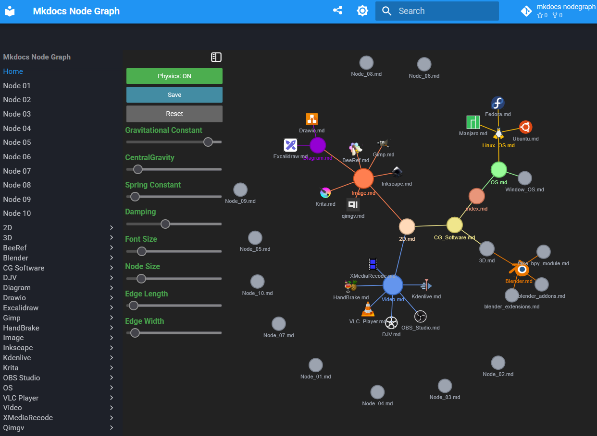

# mkdocs-nodegraph

mkdocs-nodegraph - A Plugin for Visualizing Network Graphs in MkDocs

## Summary

mkdocs-nodegraph is a documents network graph visualization plugin for the mkdocs-material. 

It allows you to create interactive visualizations of your documentation structure, helping users navigate through topics more easily. 


## Example


<p align="center">
<a>

</a>


<!--  -->


<br>

YouTube Link

- https://www.youtube.com/watch?v=KD1AsW304kc


<br>

## Install 

Install with setup.py

```shell

python.exe setup.py install

```

<br>


Install with pip

```sh
pip install mkdocs-nodegraph
```

<br>

Uninstall with pip

```
pip uninstall mkdocs-nodegraph

```


<br>

## Setup Tags, Node Icon and Color on Markdown File

```md

---
tags:
  - CG
  - 3D software
mdfile_icon: "_sources/svgs/blender.svg"
mdfile_color: "#ea7600"
---

```


<br>

## mkdocs.yml Configuration


```yml

theme:
    # pip install mkdocs-material
    name: material
    # name: readthedocs
    features:
        # - navigation.tabs
        - content.code.copy
    palette:
      # Palette toggle for dark mode
      - media: "(prefers-color-scheme: dark)"
        scheme: slate
        primary: blue
        accent: blue
        toggle:
          icon: material/brightness-7
          name: Switch to light mode
      # Palette toggle for light mode
      - media: "(prefers-color-scheme: light)"
        scheme: default
        primary: blue
        accent: blue
        toggle:
          icon: material/brightness-4
          name: Switch to dark mode

plugins:
    - search
    - offline
    - glightbox:
        skip_classes: 
            - collapse-btn
    - nodegraph:
        graphfile: "nodegraph.html"

```

<br>

After setting up the nodegraph plugin with its graphfile path, you can build your site

```shell
mkdocs build 
```

<br>

<!-- After building the site, you can click the button  to open the graph file. -->

After building the site, you can click the button  to open the graph file.


<br>


## References

- https://github.com/barrettotte/md-graph?tab=readme-ov-file
- https://pyvis.readthedocs.io/en/latest/

<br>
